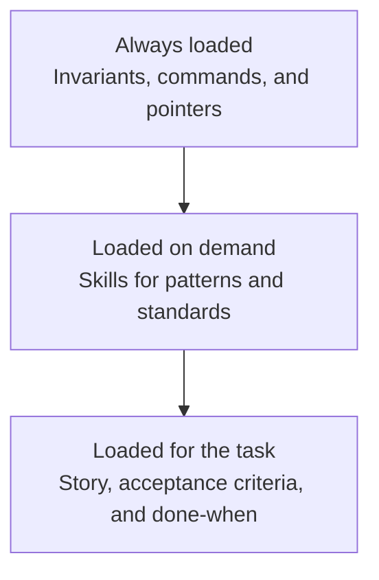
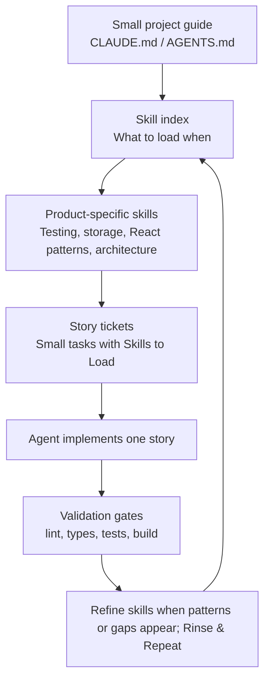

I am building [CodeQuest](https://github.com/PilHliP211/CodeQuest-Platform), a coding education platform for kids. It is the kind of side project I would normally over-plan, poke at for a weekend, and then lose momentum on once work gets busy and evenings fill up.

Agentic coding has changed that for me.

It definitely feels different from how coding used to feel. There is less typing every line by hand and more shaping the system around the agent. But there is still enough engineering judgment in the constraints, architecture, testing strategy, and review loop to keep it engaging.

The reason is not that I can ask an AI to "build the app" and wander away. That still feels like a great way to get a pile of plausible nonsense. The shift has been learning how to structure the project so an agent can take a specific slice of work and produce something consistent with the product, stack, architecture, and testing philosophy I actually want.

The idea I keep coming back to is **progressive disclosure**.

Do not put everything the agent might ever need into the first prompt. Do not turn `CLAUDE.md` into a novella. Give the agent the small amount of context it always needs, then load the deeper rules and patterns only when the current task calls for them.

That is what I mean by skills-first agentic development.

## The problem is not "better prompts"

Most agentic coding advice starts with prompt shape:

- Ask it to plan first
- Give it acceptance criteria
- Tell it to run tests
- Keep the task small

All of that helps. But after working on CodeQuest, I think the more interesting problem is not prompt writing. It is **context architecture**.

Every project accumulates little decisions:

- Where should persistent state live?
- What counts as an acceptable test?
- Which dependencies are allowed?
- Where does lesson content belong?
- What should never be hardcoded?
- What does the security boundary look like?

If those decisions only live in your head, the agent will not consistently follow them. If they all live in one giant always-loaded file, they compete with each other for attention.

That second problem matters more than I expected.

I picked up the phrase "dumb zone" from Dex Horthy's [No Vibes Allowed](https://www.youtube.com/watch?v=rmvDxxNubIg) talk. The rough idea is that a model can start getting less useful before the context window is technically full. I am not treating any specific percentage as physics, and I have not measured this on CodeQuest. But as a working mental model, it is useful: big context windows are not an invitation to shovel the whole garage into the prompt.

The goal is to keep the agent working with the right context, not the most context.

## The three layers

For CodeQuest, I ended up with three layers:



The names are not important. The separation is.

The always-loaded layer is small. In this repo, that is `CLAUDE.md`. It has the project one-liner, commands, hard rules, and a table pointing to the deeper docs.

The skills layer is where most of the reusable knowledge lives. CodeQuest has skills for TypeScript standards, React component structure, localStorage, testing strategy, content packs, security rules, accessibility, and dependency policy.

The story layer is the actual work. Each story is a small ticket with dependencies, tasks, a done-when checklist, and the key section: **Skills to Load**.

The story does not repeat the architecture. It points to the skills that matter.

That is the unlock.

## What goes in the always-loaded file

The always-loaded file should be boring.

Mine is basically:

- What this project is
- The commands the agent should know
- The 'hard rules' that are always true
- Where to find deeper guidance

That last one is the big one.

The always-loaded file should not contain every pattern, rule, and architectural decision. It should teach the agent how to find the right context when the task needs it.

For CodeQuest, the hard rules are things like:

- No `any`; use `unknown` plus type guards
- No `eval()` or `Function()`; player code uses the AST interpreter
- No hardcoded lesson content; lessons live in content pack JSON
- No `console.log`; the linter enforces `warn` and `error` only
- No `eslint-disable`; fix the code
- Tests assert on learner-observable outcomes, not internal mechanics

Testing strategy was an important iteration we made.

I started with the obvious coding rules, then realized the agent also needed a clear testing philosophy. Otherwise it could produce tests that looked responsible while locking in implementation details. That is not useful. CodeQuest tests should care about outcomes a learner or caller can observe.

"Progress survives reload" is a real outcome.

"`localStorage.setItem` was called" is usually just a mechanic.

That rule belongs in the always-loaded file because it applies to every code-producing story. The detailed guidance lives in a `testing-strategy` skill.

## Skills are product-specific context

I do not think the point of skills is to write generic advice like "write clean TypeScript."

The agent already knows generic advice. What it does not know is *your* project.

A useful skill should encode the decisions that are easy for the model to get subtly wrong:

- `content-pack-system`: lesson content belongs in JSON packs, never in platform code
- `localstorage-pattern`: all persistence goes through a typed wrapper with runtime validation
- `security-rules`: player code runs through the sandboxed interpreter path
- `testing-strategy`: tests assert on observable outcomes, not internal mechanics
- `dependency-policy`: default to no new dependency unless the package earns its place

These are not documentation chapters for humans to read someday. They are context modules for an agent that is about to touch code.

Here is the rough shape:



The feedback loop matters. If I correct the same agent mistake twice, that is a signal that the instruction probably should not live in chat. It should become a skill, or an existing skill should get sharper.

I am not claiming I executed some grand "meta-skill" architecture for CodeQuest. I did not. I don't think I did anything too groundbreaking for this project. The practical lesson is smaller and more useful: write high-quality, purpose-built skills for the product you are building.

## Stories bind the context to the task

The story files are where the system becomes usable.

A story does not just say "build the profile context." It says what depends on it, what to create, what counts as done, and which skills to load first.

For example, the learner profile context story includes this:

```md
## Skills to Load

- `react-context-pattern` - the canonical provider/hook shape
- `react-component-structure` - file layout, named exports
- `localstorage-pattern` - provider does its own persistence
- `typescript-standards` - `useMemo` typing
```

That is the difference between "go build this feature" and "go build this feature using the patterns this codebase has already chosen."

The story does not need to paste the whole localStorage policy. It just names the skill. The story stays small, and the pattern stays reusable.

This is also why I like the term progressive disclosure here. The agent sees the lightest possible thing first:

1. The project guide tells it where things live.
2. The story tells it which skills apply.
3. The skills provide the detailed rules only when relevant.

That is a much better shape than one giant document trying to be a quick reference, architecture guide, security policy, style guide, and testing manifesto all at once.

## Why this has worked well for a side project

It is still early. I am just now starting Epic 3, so I do not want to oversell this as a proven methodology with hard metrics behind it.

But it truly already feels different. And I'm excited about that in a way I haven't been excited about coding since AI tools became the norm.

I can hand the agent a story or a small set of tickets and get output that feels more consistent than the usual "impressive first draft, suspicious second pass" AI coding experience. The difference is the prep work:

- The stories are small enough to fit a dozen of them in a single session so that the agent can stop early if it hits an issue and still have accomplished something.
- The relevant skills are named up front
- The validation gates are explicit
- The architecture rules are written down
- The testing philosophy is part of the system

That last part is especially important for me because CodeQuest is a side project. I am not trying to optimize a large engineering organization right now. I am trying to make it easier to get a real product moving when I only have slices of time around everything else.

The prep makes it exponentially easier to restart, scrap what doesn't work and iterate on what does.

Instead of reloading the whole idea into my head every time, I can pick the next stories, say "start on X" from my smartphone and keep moving. That is the difference between "I should build that someday" and "work on the next ticket."

## The payoff is boring prompts

Once the repo carries enough of the context, the prompt can get plain.

That is the part I want for side projects. If I have planned the epic, written the stories, and bound the right skills to the work, I do not need to sit down at my desk and perform an elaborate ritual every time I want progress. I can prompt from my phone: work on this story, load the skills it asks for, run the gates, and tell me what changed.

For a bigger push, that same shape starts to look like something you could wrap in a [Ralph loop](https://ghuntley.com/ralph/), Geoffrey Huntley's beautifully unhinged pattern of putting a coding agent in a loop and letting it keep working against a prompt, a plan, and the repo's feedback systems.

I would not do that against a vague backlog and a pile of vibes. That is just a Roomba with commit access.

But against small stories, explicit skills, and deterministic checks? That gets more interesting. The loop has signs to read. It has guardrails. It has a definition of done. It has a way to be wrong and learn something useful instead of just wandering through the codebase with confidence.

## This is not really about Claude

The files in CodeQuest are Claude-shaped because that is where I started: `CLAUDE.md`, `.claude/skills/`, and so on.

I am not emotionally attached to that.

If Codex gives me the same phone workflow I want on Android, I will switch from my phone, rename whatever needs renaming, and act like this was always a principled tool-agnostic architecture decision. I contain multitudes, and apparently some of those multitudes are waiting on a Play Store listing from Open AI.

The concept is what matters:

- Keep always-loaded context small
- Put reusable product knowledge in skills
- Bind skills to specific work items
- Verify with deterministic gates
- Improve the skills when the agent repeats a mistake

Whether the folder is called `.claude/skills`, `.codex/skills`, `docs/agent-skills`, or something else is an implementation detail.

## A recipe

If I were starting another agentic-first side project this way, I would instruct an LLM to do it like this:

1. Write the smallest possible project guide.

   Include commands, non-negotiable rules, and links to deeper docs. Cut anything that does not apply to almost every session.

2. Create a skills index.

   List the skills by category and explain when to load each one. The "when to load" line is the most important part. If you cannot write that line clearly, the skill is probably too broad.

3. Write product-specific skills.

   Start with the patterns most likely to drift: architecture boundaries, persistence, testing, dependency policy, error handling, security, and UI patterns.

4. Break epics into small stories.

   A story should have one job. It should fit in a tenth of a single agent session. It should have dependencies, tasks, and a done-when checklist.

5. Add `Skills to Load` to every story.

   This is the binding mechanism. Do not make the agent guess which parts of the rulebook apply.

6. Make verification explicit.

   The agent should know which checks to run: lint, typecheck, tests, build, or whatever applies to the story. If it cannot verify its own work, you are the only feedback loop.

7. Promote repeated corrections into skills.

   If you keep typing the same correction, stop pasting it into chat. Move it into the system.

That is the part I like most. The project gets better at accepting agent work over time.

Not because the model changed. Because the repo got better at explaining itself.

## Further reading

This workflow is not explicitly based on agent research papers, but it overlaps with a few ideas that are worth reading if you are trying to level up your agentic coding process:

- [Claude Code best practices](https://code.claude.com/docs/en/best-practices) - context management, concise `CLAUDE.md` files, and giving the agent a way to verify work
- [Claude Skills overview](https://claude.com/docs/skills/overview) - Anthropic's framing of skills as progressive disclosure for context
- [No Vibes Allowed](https://www.youtube.com/watch?v=rmvDxxNubIg) - Dex Horthy's talk on solving hard problems in complex codebases with more intentional context engineering
- [ReAct](https://arxiv.org/abs/2210.03629) - reasoning and acting interleaved
- [Tree of Thoughts](https://arxiv.org/abs/2305.10601) - exploring and evaluating multiple reasoning paths
- [Reflexion](https://arxiv.org/abs/2303.11366) - using feedback and reflection as memory without changing model weights
- [Voyager](https://arxiv.org/abs/2305.16291) - an agent that builds and reuses an expanding skill library

I would not describe CodeQuest as an implementation of any of those papers. It is much more practical than that.

I had a side project I wanted to stop abandoning, a coding agent that could move fast, and a growing suspicion that better prompts were not enough.

So I made the repo easier for the agent to understand one story at a time.
